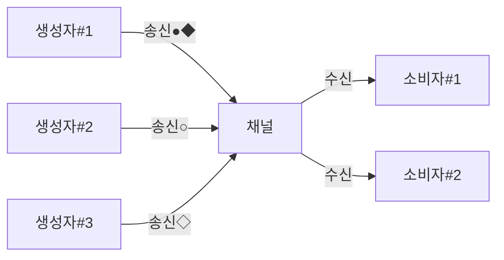
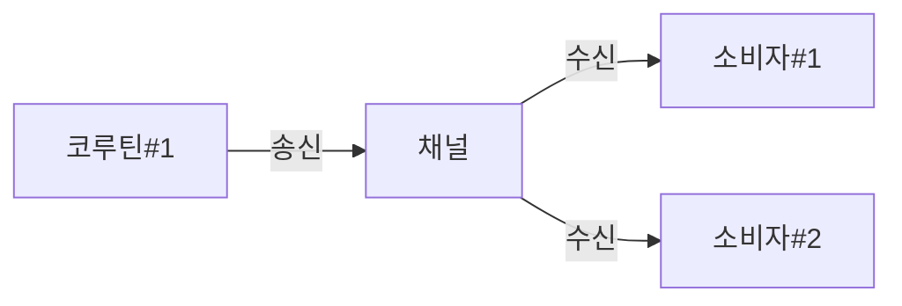
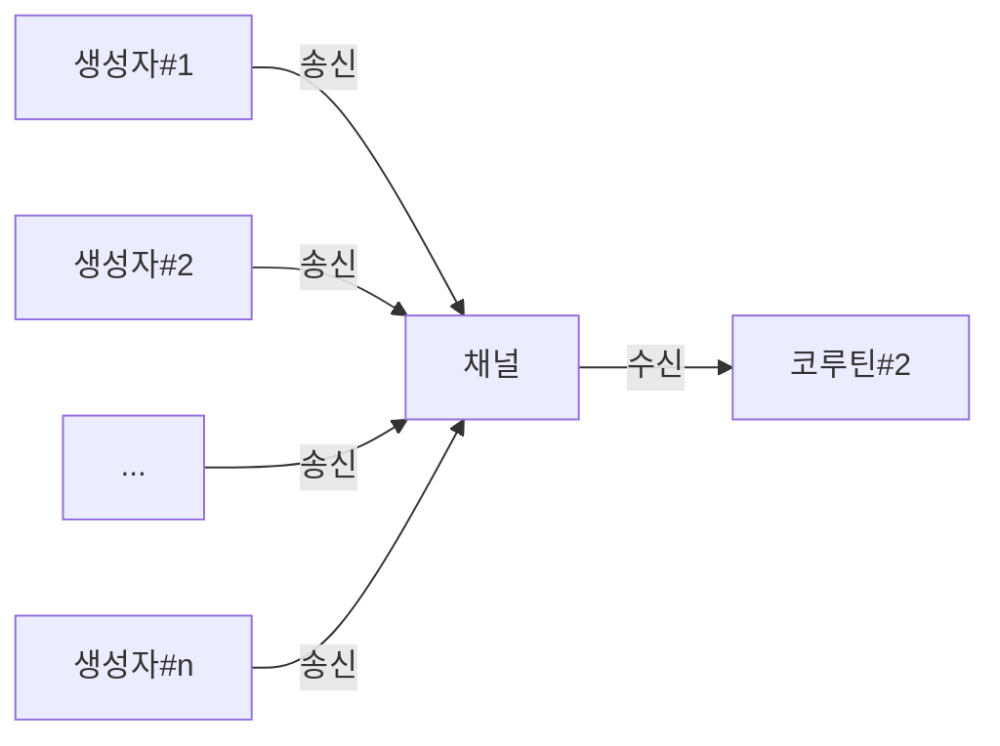

# 채널과 플로우

* TOC
  {:toc}

코루틴끼리의 통신을 위한 기본적인 방법으로 채널 API가 추가되었다.

채널은 송신자와 수신자의 수에 제한이 없으며, 채널을 통해 전송된 모든 값을 단 한 번만 받을 수 있다.

### Channel

Channel은 두 개의 서로 다른 인터페이스를 구현하는 하나의 인터페이스이다.

[markdown chart plugin](https://mermaid.js.org/syntax/flowchart.html)




* SendChannel은 원소를 보내거나(또는 더하거나) 채널을 닫는 용도로 사용된다.
* ReceiveChannel은 원소를 받을 때(또는 꺼낼 때) 사용된다.

```
interface SendChannel<in E> {
    suspend fun send(element: E)
    fun close(): Boolean
    // ...
}

interface ReceiveChannel<out E> {
    susped fun send(element: E)
    fun close(): Boolean
    // ...
}
```

send와 receive 모두 중단함수인 것을 확인할 수 있다.

* receive를 호출했는데 채널에 원소가 없다면 코루틴은 원소가 들어올 때까지 중단된다.
* send는 채널 용량이 다 찼을 때 중단된다.

채널은 송신자와 수신자의 수에 제한이 없다. 하지만 채널의 양쪽 끝에 각각 하나의 코루틴만 있는 경우가 가장 일반적이다.

예제 코드

```kotlin
suspend fun main(): Unit = coroutineScope {
    val channel = Channel<Int>()
    launch {
        repeat(5) { index ->
            delay(1000)
            println("Producing next one")
            channel.send(index * 2)
        }
    }

    launch {
        repeat(5) {
            val received = channel.receive()
            println(received)
        }
    }
}

/*
Producing next one
0
Producing next one
2
Producing next one
4
Producing next one
6
Producing next one
8
 */
```

채널이 닫힐 때 까지 원소를 받기 위해 for 루프나 consumeEach 함수를 사용할 수 있다.

```kotlin
suspend fun main(): Unit = coroutineScope {
    val channel = Channel<Int>()
    launch {
        repeat(5) { index ->
            delay(1000)
            println("Producing next one")
            channel.send(index * 2)
        }
        channel.close()
    }

    launch {
        for (element in channel) {
            println(element)
        }
//         또는
//        channel.consumeEach { element ->
//            println(element)
//        }
    }
}

/*
Producing next one
0
Producing next one
2
Producing next one
4
Producing next one
6
Producing next one
8
 */

```

> 채널 닫기가 중요하다 예외로 인해 원소를 보내는 걸 중단하면 영원히 가디려야 하는 문제가 발생된다.

### 채널 타입

* 무제한(Unlimited): 제한이 없는 용량 버퍼를 가진 Channel.UNLIMITED로 설정된 채널로, send가 중단되지 않습니다.
* 버퍼(Buffered): 특정 용량 크기 또는 Channel.BUFFERED(기본값은 64이며 JVM의 kotlinx.couroutines.channels.defaultBuffer를 설정하면 오버라이드 할수
  있다.)로 설정된 채널
* 랑데뷰(Rendezvous) : 용량이 0이거나 Channel.RENDEZVOUS(용량이 0이다)인 채널로, 송신자와 수신자가 만날 때만 원소를 교환한다.
* 융합(Conflated) 버퍼 크기가 1인 Channel.CONFLATED를 가진 채널로, 새로운 원소가 이전 원소를 대체한다.

이런 설정들로 송신자를 빠르게, 수신자를 느리게 만들 수도 있다. 용량이 무제한 채널은 모든 원소를 받고 수신자가 하나씩 가져가게 된다.

--- 

#### webflux에서 비슷한 유형으로 작성된 내용을 읽은 적이 있다. 관련된 예제를 한번 알아봄

WebFlux는 Spring Framework에서 제공하는 비동기, 논블로킹 웹 프레임워크로, Reactive Streams API를 기반으로 합니다. Reactive Streams는 데이터 스트림을 비동기적으로
처리하면서 백프레셔(backpressure)를 관리하는 메커니즘을 제공합니다. 백프레셔란, 데이터를 생성하는 속도와 소비하는 속도 간의 불일치를 해결하기 위해 소비자가 처리할 수 있는 데이터의 양을 제어하는
메커니즘을 말합니다.

의미 정리
송신자를 빠르게, 수신자를 느리게 만들 수 있다는 것은, 송신자(데이터를 생성하는 쪽)가 수신자(데이터를 소비하는 쪽)보다 데이터를 빠르게 생성할 수 있음을 의미합니다. 이 경우, 수신자가 처리할 수 있는 속도를
초과하는 데이터는 버퍼링되거나 다른 방식으로 처리되어야 합니다.

용량이 무제한 채널은 모든 원소를 받고 수신자가 하나씩 가져가게 된다는 것은, 백프레셔를 적용하지 않거나 무제한으로 설정했을 때의 상황을 설명합니다. 이 경우, 모든 데이터가 수신자에게 전송되고, 수신자는 자신의
처리 속도에 맞추어 데이터를 하나씩 처리합니다. 이는 메모리 사용량이 증가하고 시스템이 과부하될 수 있는 위험이 있기 때문에 주의해서 사용해야 합니다.

--- 

```kotlin
suspend fun main(): Unit = coroutineScope {
    val channel = produce(capacity = Channel.UNLIMITED) {
        repeat(5) { index ->
            send(index * 2)
            delay(100)
            println("Sent")
        }
    }

    delay(1000)
    for (element in channel) {
        println(element)
        delay(1000)
    }
}

/*
Sent
Sent
Sent
Sent
Sent
0
2
4
6
8
 */
```

정해진 크기의 용량을 가지고 있다면 버퍼가 가득 찰 때까지 원소가 생성되고, 이후에 생성자는 수신자가 원소를 보기하기를 기다리기 시작한다.

```kotlin
suspend fun main(): Unit = coroutineScope {
    val channel = produce(capacity = 3) {
        repeat(5) { index ->
            send(index * 5)
            delay(100)
            println("Sent")
        }
    }

    delay(1000)
    for (element in channel) {
        println(element)
        delay(1000)
    }
}

/*
Sent
Sent
Sent
0
Sent
5
Sent
10
15
20
 */
```

(자체적으로 배압을 조절할 수 있을 것 같은 느낌이네)

Channel.CONFLATED 용량을 사용하면 이전 원소를 더 이상 저장하지 않는다. 최근 원소만 받을 수 있게 되므로, 먼저 보내진 원소는 유실된다.

```kotlin
suspend fun main(): Unit = coroutineScope {
    val channel = produce(capacity = Channel.CONFLATED) {
        repeat(5) { index ->
            send(index * 2)
            delay(100)
            println("Sent")
        }
    }

    delay(1000)
    for (element in channel) {
        println(element)
        delay(1000)
    }
}

/*
Sent
Sent
Sent
Sent
Sent
8
 */

```

### 버퍼 오버플로일 때

채널을 커스텀화하기 위해 버퍼가 꽉 찼을 때(onBufferOverflow 파라미터)의 행동을 정의할 수 있다.

* SUSPEND(기본 옵션): 버퍼가 가득찼을 때, send 메서드가 중단된다.
* DROP_OLDEST: 버퍼가 가득 찼을 때, 가장 오래된 원소가 제거된다.
* DROP_LATEST: 버퍼가 가득 찼을 때, 가장 최근의 원소가 제거된다.

```kotlin
suspend fun main(): Unit = coroutineScope {
    val channel = Channel<Int>(
        capacity = 2,
        onBufferOverflow = BufferOverflow.DROP_OLDEST
    )

    launch {
        repeat(5) { index ->
            channel.send(index * 2)
            delay(100)
            println("Sent")
        }
        channel.close()
    }

    delay(1000)
    for (element in channel) {
        println(element)
        delay(1000)
    }
}

/*
Sent
Sent
Sent
Sent
Sent
6
8
 */
```

### 전달되지 않은 원소 핸들러

channel 함수에서 반드시 알아야 할 또 다른 파라미터는 onUndeliveredElement 이다. 원소가 어떤 일로 처리되지 않을 때 호출된다. 대부분 채널이 닫히거나 취소되었음을 의미하지만, send,
receive, receiveOrNull 또는 hasNext가 에러를 던질 때 발생할 수도 있다.

```kotlin
import java.nio.channels.Channel

val channel = Channel<Resource>(capacity) { resource ->
    resource.close()
}

//또는
//val channel = Channel<Resource>(
//    capacity,
//    onUndeliveredElement = { resource ->
//        resouce.close()
//    }
//)

// 생성자 코드
val resourceToSend = openResouce()
channel.send(resourceToSend)
// 소비자 코드
val resourceReceived = channel.receive()
try {
    // 수신한 자원으로 작업합니다.
} finally {
    resourceReceived.close()
}
```

### 팬아웃(Fan-out)

여러 개의 코루틴이 하나의 채널로부터 원소를 받을 수도 있다. 하지만 원소를 적절하게 처리하려면 반드시 for 루프를 사용해야 한다.



```kotlin
fun CoroutineScope.produceNumbers() = produce {
    repeat(10) {
        delay(100)
        send(it)
    }
}

fun CoroutineScope.launchProcessor(
    id: Int,
    channel: ReceiveChannel<Int>
) = launch {
    for (msg in channel) {
        println("#$id received $msg")
    }
}

suspend fun main(): Unit = coroutineScope {
    val channel = produceNumbers()
    repeat(3) { id ->
        delay(10)
        launchProcessor(id, channel)
    }
}

/*
#0 received 0
#1 received 1
#2 received 2
#0 received 3
#1 received 4
#2 received 5
#0 received 6
#1 received 7
#2 received 8
#0 received 9
 */

```

원소는 공평하게 분배됨.

### 팬인(Fan-in)

여러개의 코루틴이 하나의 채널로 원소를 전송할 수 있다.



```kotlin
suspend fun sendString(
    channel: SendChannel<String>,
    text: String,
    time: Long
) {
    while (true) {
        delay(time)
        channel.send(text)
    }
}

fun main() = runBlocking {
    val channel = Channel<String>()
    launch { sendString(channel, "foo", 200L) }
    launch { sendString(channel, "BAR!", 500L) }
    repeat(50) {
        println(channel.receive())
    }
    coroutineContext.cancelChildren()
}
/*
foo
foo
BAR!
foo
...
 */
```

다수의 채널을 하나의 채널로 합치는 경우도 있는데, 이럴 경우 produce함수로 여러 개의 채널을 합치는 fanIn 함수를 사용할 수 있다.

```kotlin
fun <T> CoroutineScope.fanIn(
    channels: List<ReceiveChannel<T>>
): ReceiveChannel<T> = produce {
    for (channel in channels) {
        launch {
            for (elem in channel) {
                send(elem)
            }
        }
    }
}
```

### 파이프라인

한 채널로부터 받은 원소를 다른 채널로 전송하는 경우가 있는데, 이를 파이프라인이라 부른다.

```kotlin
fun CoroutineScope.numbers(): ReceiveChannel<Int> = produce {
    repeat(3) { num ->
        send(num + 1)
    }
}

fun CoroutineScope.square(numbers: ReceiveChannel<Int>) = produce {
    for (num in numbers) {
        send(num * num)
    }
}

suspend fun main() = coroutineScope {
    val numbers = numbers()
    val squared = square(numbers)
    for (num in squared) {
        println(num)
    }
}
/*
1
4
9
 */
```

### 통신의 기본 형태로서의 채널

채널은 서로 다른 코루틴이 통신할 때 유용하다. 충돌이 발생하지 않으며(공유 상태로 인한 문제가 일어나지 않는다.), 공평함을 보장한다.

### 실제 사용 예

채널을 사용하는 전형적인 예는 데이터가 한 쪽에서 생성되고 다른 쪽에서 데이터를 처리하는 것이다. (push pull? publish subscribe?).  
사용자의 클릭에 반응하는 경우, 서버로부터 새로운 알림이 오는 경우, 시간이 흐르면서 검색 결과를 업데이트하는 경우(여러개의 항공사 홈페이지에 질의해 가장 싼 항공편을 찾는 스카이스캐너가 좋은 예)를 예로 들 수
있다.  
(~~이전 항공서비스 때 이 부분을 최적화 하려고 했었지만? 생각보다 각 요청 응답을 기다린 뒤에 응답을 주는 구조로 작성되다보니 꽤 오랜 시간 대기 시간이 걸렸는데, 이 부분을 채널을 이용하면 간단하게 풀 수
있을까?~~ 예제 작성 예정. chapter 2가 merge 되지 않아서 못함..)

# 셀렉트

select는 가장 먼저 완료되는 코루틴의 결과값을 기다릴 때나, 여러개의 채널 중 전송 또는 수신 가능한 채널을 선택할 때 사용된다.

> select함수는 코틀린 코루틴이 정식적으로 출시된 이후부터 사용이 가능했지만, 여전히 실험용이라고 책에서 소개한다.

## 지연되는 값 선택하기

여러개의 소스에 데이터를 요청한 뒤, 가장 빠른 응답만 얻는 경우 동시에 전체 작업이 끝나게 되는 기능이다.

```kotlin
suspend fun requestData1(): String {
    delay(10000)
    return "Data1"
}

suspend fun requestData2(): String {
    delay(1000)
    return "Data2"
}

val scope = CoroutineScope(SupervisorJob())

suspend fun askMultipleForData(): String {
    val defData1 = scope.async { requestData1() }
    val defData2 = scope.async { requestData2() }
    return select {
        defData1.onAwait { it }
        defData2.onAwait { it }
    }
}

suspend fun main(): Unit = coroutineScope {
    println(askMultipleForData())
}

/*
Data2
(종료)
 */
```

async와 select를 사용하면 코루틴끼리 경합하는 상황을 쉽게 구현할 수 있지만, 스코프를 명시적으로 취소해야 한다.

```kotlin
import kotlin.coroutines.coroutineContext

suspend fun requestData1(): String {
    delay(10000)
    return "Data1"
}

suspend fun requestData2(): String {
    delay(1000)
    return "Data2"
}

val scope = CoroutineScope(SupervisorJob())

suspend fun askMultipleForData(): String {
    val defData1 = scope.async { requestData1() }
    val defData2 = scope.async { requestData2() }
    return select<String> {
        defData1.onAwait { it }
        defData2.onAwait { it }
    }.also { coroutineContext.cancelChildren() }  // <-- 추가
}

suspend fun main(): Unit = coroutineScope {
    println(askMultipleForData())
}

/*
Data2
(종료)
 */
```

### 채널에서 값 선택하기

* onReceive: 채널이 값을 가지고 있을 때 선택된다.
* onReceiveCatching: 채널이 값을 가지고 있거나 닫혔을 때 선택된다.
* onSend: 채널의 버퍼에 공간이 있을 때 선택된다.

## 핫 데이터 소스와 콜드 데이터 소스

코틀린 코루틴은 처음에는 채널만 가지고 있었지만, 코루틴 개발자들은 이것만으로는 부족하다는 것을 깨달았다. 채널은 값을 '핫(hot)' 스트림으로 가지지만, '콜드(cold)' 스크림이 필요할 때가 있다.

* List와 Set 컬렉션은 핫이며, Sequence와 자바의 Stream은 콜드이다.
* Channel은 핫이지만 Flow와 (Observable, Single과 같은) RxJava 스크림은 콜드이다.

### 핫 vs 콜드

핫 데이터 스트림은 열정적이라 데이터를 소비하는 것과 무관하게 원소를 생성하지만, 콜드 데이터 스트림은 게을러서 요청이 있을 때만 작업을 수행하며 아무것도 저장하지 않는다.

콜드 데이터 스트림의 특징

* 무한할 수 있다.
* 최소한의 연산만 수행한다.
* (중간에 생성되는 값들을 보관할 필요가 없기 때문에) 메모리를 적게 사용한다.

핫 데이터 스트림 특징

* 항상 사용 가능한 상태이다.(각 연산이 최종 연산이 될 수 있다)
* 여러 번 사용되었을 때 매번 결과를 다시 계산할 필요가 없다.

자바의 Stream은 코틀린의 Sequence와 비슷한 특징을 가지고 있다. 둘 모두 콜드 스트림 데이터이다.

### 핫 채널, 콜드 플로우

플로우를 생성하는 가장 일반적인 방법은 produce함수와 비슷한 형태의 빌더를 사용하는 것이다. 이 빌더가 바로 flow이다.

```kotlin
val channel = produce {
    while (true) {
        val x = computeNextValue()
        send(x)
    }
}

val flow = flow {
    while (true) {
        val x = computeNextValue()
        emit(x)
    }
}
```

두 빌더는 개념적으로 동일하지만, 채널과 플로우의 방식이 아주 다르기 때문에 두 함수에도 중요한 차이가 있다.  
채널은 핫이라 값이 곧바로 계산된다. 별도의 코루틴에서 계산을 수행한다. 따라서 produce는 coroutineScope의 확장 함수로 정의되어 있는 코루틴 빌더가 되어야 한다.  
채널은 핫 데이터 스트림이기 때문에 소비되는 것과 상관없이 값을 생성한 뒤에 가지게 된다.

플로우는 콜드 데이터 소스이기 때문에 값이 필요할 때만 생성된다. 따라서 flow는 빌더가 아니며 어떤 처리도 하지 않는다. flow는 단지(collect와 같은) 최종 연산이 호출될 때 원소가 어떻게 생성되어야
하는지 정의에 불가한 것이다. 따라서 flow 빌더는 CoroutineScope가 필요하지 않다.

## 플로우란 무엇인가?

플로우(flow)는 비동기적으로 계산해야 할 값의 스트림을 나타낸다. flow인터페이스 자체는 떠다니는 원소들을 모으는 역할을 하며, 플로우의 끝에 도달할 때까지 각 값을 처리하는 걸 의미한다.

```kotlin
interface Flow<out T> {
    suspend fun collect(collector: FlowCollector<T>)
}
// 얘는 공변인가? 불변인가? => 공변인 듯
```

flow의 유일한 멤버 변수는 collect이다. iterator만 멤버 함수로 가지고 있는 Interable 또는 Sequence와 비슷하다고 볼 수 있다.

### 플로우와 값을 나타내는 다른 방법들의 비교

flow의 개념은 RxJava나 Reactor를 사용하는 사람들은 잘 알고 있지만, 그 밖의 사람들에겐 좀더 상세한 명이 필요하다.

### 시퀀트 빌더 특징

* 시퀀스는 (복잡한 결괏값을 계산하는 등의) CPU 집약적인 연산 또는 (파일을 읽는 등의) 블록킹 연산이 필요할 때마다 값을 계산하는 플로우를 나타내기 적절하다.
* 시퀀스 내부에 중단점이 있다면 값을 기다리는 스레드가 블로킹 된다.
* 시퀀스 빌더의 스코프에서는 SquenceScope의 리시버에서 호출되는 함수 (yield, yieldAll)외에 다른 중단함수는 사용할 수 없다.
* 데이터 소스의 개수가 많거나(또는 무한정이거나) 원소가 무거운 경우, 원소를 필요할 때만 계산하거나 읽는 지연 연산을 하게 되는 상황에서 시퀀스가 정확히 들어 맞는다.

### 플로우의 특징

* 플로우의 최종 연산은 스레드를 블로킹하는 대신 코루틴을 중단시킨다.
* 플로우는 코루틴 컨텍스트를 활용하고 예외를 처리하는 등의 코루틴 기능도 제공한다.
* 플로우 처리는 취소 가능하며, 구조화된 동시성을 기본적으로 갖추고 있다.
* 플로우 빌더는 중단 함수가 아니며 어떠한 스코프도 필요하지 않는다.
* 플로우의 최종 연산은 중단 가능하며, 연산이 실행될 때 부모 코루틴과의 관계가 정립된다.

### 플로우 명명법

* 플로우는 어딘가에서 시작되어야 한다.
* 플로우의 마지막 연산은 `최종연산`이라 불리며, 중단 가능하거나 스코프를 필요로 하는 유일한 연산이라는 점에서 아주 중요하다.
* 시작 연산과 최종 연산 사이에 플로우를 변경하는 중간 연산(intermediate operation)을 가질 수 있다.

```kotlin
suspend fun main() {
    flow { emit("Message 1") }   // <-- 플로우 빌더
        .onEach { println(it) }                             // <--
        .onStart { println("Do something before") }         // 중간 연산
        .onCompletion { println("Do something after") }     // <--
        .catch { emit("Error") }
        .collect { println("Collected $it") } // <-- 최종 연산
}
```

### 실제 사용되는 예

현업에서는 채널보다 플로우가 필요한 경우가 더 많다. 데이터 스트림을 사용하면, 대부분은 데이터가 필요할 때마다 요청한다.  
데이터베이스에서의 변경이나 UI 위젯의 변화 또는 센서와 같이 이벤트를 감지해야 할 필요가 있다면, 감지하는 모듈 각각이 이벤트를 받게 된다.

플로우가 사용되는 전형적인 예

* 웹소켓이나 RSocket 알림과 같이 서버가 보낸 이벤트를 통해 전달된 메시지를 받는 경우
* 텍스트 입력 또는 클릭과 같은 사용자 액션이 감지된 경우
* 센서 또는 위치나 지도와 같은 기기의 정보 변경을 받는 경우
* 데이터베이스의 변경을 감지하는 경우 (<--?? 이건 예제가 필요할 듯)

플로우는 동시성 처리를 위해 유용하게 사용될 수 있다.

### 함수를 플로우로 바꾸기

```kotlin
suspend fun main() {
    val function = suspend {
        delay(1000)
        "UserName"
    }

    function.asFlow()
        .collect { println(it) }
}
// UserName
```

### 플로우와 리액티브 스트림

Flux, Flowable, Obserable은 kotlin-coroutines-reactive 라이브러리의 asFlow 함수를 사용해 Flow로 변환 가능한 Publisher 인터페이스를 구현하고 있다.

```kotlin
suspend fun main() = coroutineScope {
    Flux.range(1, 5).asFlow()
        .collect { print(it) } //12345
    Flowable.range(1, 5).asFlow()
        .collect { print(it) } //12345
    Obserable.range(1, 5).asFlow()
        .collect { print(it) } //12345
}
```

### 채널플로우

channelFlow 함수는 플로우처럼 Flow 인터페이스를 구현하기 때문에 플로우가 가지는 특징을 제공한다. 채널 플로우 빌더는 일반 함수이며(collect와 같은) 최종 연산으로 시작된다. 한 번 시작하기만 하면
리시버를 기다릴 필요 없이 분리된 코루틴에서 값을 생성한다는 점이 채널과 비슷하다고 할 수 있다.

## 플로우 생명주기 함수

플로우는 요청이 한쪽 방향으로 흐르고 요청에 의해 생성된 값이 다른 방향으로 흐르는 파이프라 생각할 수 있다.

#### onEach

플로우의 값을 하나씩 받을 수 있다.

#### onStart

첫 번째 원소를 요청했을 때 호출되는 함수이다.

#### onCompletion

플로우가 완료되었을 때 호출되는 리스너를 추가할 수 있다.

#### onEmpty

기본 값을 내보내기 위한 목적으로 사용될 수 있다.

#### catch

예외를 인자로 받고 정리를 위한 연산을 수행할 수 있다.

#### flowOn

flowOn함수로 컨텍스트를 변경할 수 있다.

#### launchIn

플로우의 확장 함수인 launchIn을 사용하면 유일한 인자로 스코프를 받아 collect를 새로운 코루틴에서 시작할 수 있다.

## 플로우 처리

플로우를 값이 흐르는 파이프로 생각했다. 값이 흐르기 떄문에 제외하고, 곱하고, 변형하거나 합치는 등의 여러 가지 방법으로 변경하는 것도 가능하다. 플로우 생성과 최종 연산 사이의 이러한 연산들은 플로우 처리라고
한다.

기본적인 stream 라이브러리에서 제공해주는 연산들을 알려줘서 제외 ;;
위에 생명주기 함수도 제외하려다가 남겨놓음 ㅠㅠ

## 공유플로우와 상태플로우

### 공유플로우

공유플로우를 통해 메시지를 보내면 대기하고 있는 모든 코루틴이 수신하게 된다.

### shareIn

플로우는 사용자 액션, 데이터베이스 변경, 또는 새로운 메시지와 같은 변활르 감지할 때 주로 사용된다.  
하나의 플로우로 여러 개의 플로우를 만들고 싶다면 SharedFlow를 사용하면 된다. Flow를 SharedFlow로 변경하는 방법은 shareIn 함수를 사용하는 것이다.

```kotlin
suspend fun main(): Unit = coroutineScope {
    val flow = flowOf("A", "B", "C")
        .onEach { delay(1000) }
    val sharedFlow: SharedFlow<String> = flow.sharedIn(
        scope = this,
        started = SharingStarted.Eagerly,
    )

    delay(500)
    launch {
        sharedFlow.collect { println("#1 $it") }
    }

    delay(1000)
    launch {
        sharedFlow.collect { println("#2 $it") }
    }

    delay(1000)
    launch {
        sharedFlow.collect { println("#3 $it") }
    }
}
```

shareIn 함수는 SharedFlow를 만들고 Flow의 원소를 보낸다. 플로우의 원소를 모으는 코루틴을 시작하므로, shareIn 함수는 첫 번째 인자로 코루틴 스코프를 받는다. 세 번째 인자는 기본값이 0인
replay이다.

두번째 인자인 started가 흥미로운데, 리스너의 수에 따라 값을 언제부터 감지할 지 결정한다. 옵션 목록은 음과 같다.

* SharingStarted.Eagerly : 즉시 값을 감지하기 시작하고 플로우로 값을 전송한다.
* SharingStarted.Lazily: 첫 번째 구독자가 나올 때 감지하기 시작한다.
* whileSubscribed() : 첫 번째 구독자가 나올 때 감지하기 시작하며, 마지막 구독자가 사라지면 플로우도 멈춘다.

### 상태플로우

상태플로우는 공유플로우의 개념을 확장시킨 것으로, replay 인자 값이 1인 공유플로우와 비슷하게 작동한다. 상태플로우는 value 프로퍼티로 접근 가능한 값 하나를 항상 가지고 있다.
